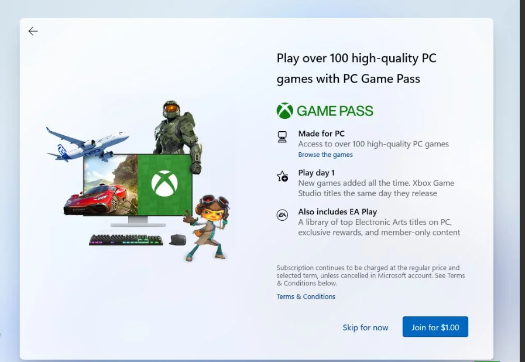

# Dev_Setup
Setup Development Environment

#Assignment: Setting Up Your Developer Environment

#Objective:
This assignment aims to familiarize you with the tools and configurations necessary to set up an efficient developer environment for software engineering projects. Completing this assignment will give you the skills required to set up a robust and productive workspace conducive to coding, debugging, version control, and collaboration.

#Tasks:

1. Select Your Operating System (OS):
   Choose an operating system that best suits your preferences and project requirements. Download and Install Windows 11. https://www.microsoft.com/software-download/windows11

   steps to install windows 11
      step 1: Visit https://www.microsoft.com/software-download/windows11 and download the windows 11 setup. please do check for the system requirement before you can actually begin the installation. 
      step 2: After obtaining the licence for your windows, you need to create Windows 11 Installation Media. A blank DVD disc with at least 8GB (and DVD burner) to create a bootable disc. We recommend using a blank USB or blank DVD, because any content on it will be deleted during installation.
      step 3: Check if your pc has;
         Has a 64-bit CPU: Windows 11 can only run on 64-bit CPUs. To see if your PC has one, go to Settings > System > About, or search “System Information” in Windows and look under “System Type.”
         Windows 11 Media Creation Tool creates installation media only for x64 processors. For ARM-based PCs, you should wait until you are notified through Windows Update that the upgrade is ready for your PC.
         Meets system requirements: Not all devices running Windows 10 are eligible to receive a Windows 11 upgrade. See the Note below with the link to: Windows 11 device specifications for upgrade requirements and supported features. Certain features require for additional hardware.
         WARNING: Installing Windows 11 media on a PC that does not meet the Windows 11 minimum system requirements is not recommended and may result in compatibility issues. If you proceed with installing Windows 11 on a PC that does not meet the requirements, that PC will no longer be supported and won't be entitled to receive updates. Damages to the PC due to lack of compatibility aren't covered under the manufacturer warranty.
      step 4: After cretaion of the bootable media, insert the installation media (USB or CD) into the optical bay ot the bootable USB disk into your computer.
      step 5: Press the F8 key multiple times while the computer starts to call the boot manager menu.
      

      step 6: Use the arrow keys to select the drive unit that contains the windows 11 installer. some drives may show up twice. if so i recommend you choose the version that's named EFI or UEFI. This is the best way to install windows 11 and its a hassle to switch UEFI after installing the OS in legacy BIOS mode.
      step 7: Amessage to press any key to boot from the CD or DVD.. apeears. Doing so will start the actual windows 11 installation process and the new windows 11 flat logo will show up.
      
      

      step 7: First step is to choose to install now. on this screen, you'll also see an option to repair your computer. Ignore this for this guide.
      

      step 8: The installer willask now to choose the language of the interface, the time and currency format, and the keyboard layout. these can be mixed and matched to your preference, and dont need to reflect reality. changing them at a later date is possible without re-installing windows 11.
      

      step 9: Here, you will be asked to enter thw windows 11 product key. this step can be skipped for now, but you will have to eventually activate windows 11to get all the features. be carefult to provide and enter the correct code provided with your licence.
      

      step 10: Now its time to select the windows edition you want to install. your selection must match the product key entered earlier or else windows wont activate.
      

      step 11: Accept the licencing terms (EULA)
      

      step 12: Next select the installation type. there are two options: Upgrade an existing installationof windows (version 78 or 10) or custom. Choose custom
      

      step 13: Here you will see the available disks detected in your computer. let the installer know the disk where Windows 11 files will be copied. You can choose to partition the existing disk into smaller virtual disks.
      

      step 14: The installer will now start to copy the required files from the install medium to the final destination. Here a reboot will happen
      
      

      step 15: Next step, select the geographical region and keyboard layout.
      

      step 16: Name your pc screen. Here i suggest you enter a computer name that recognizable and easy to remember.
      
      step 17: The installer will now check for any updates and downloads them.
      
      step 18: Select for personal use for the usgae scenario
      
      step 19: Next step is to create the administrator account for this PC. Try to stick with the offline account for privacy reasons.
      

      step 20: Setup security 3 security questions
      

      step 21: If you signed in using the Microsoft account, you will be asked to Create a PIN to log in quicker to your computer, instead of using the password.
      

      step 22: Choose setup device as new in the next window
      

      step 23: Next is to configure your privacy settings. 
      

      step 24: In the next step, windows willa sk you to select the activities you'll be doing with the new machine. Based on your selection, windows will do some personalizations for tips, ads and personalizations. You can just skip these and change later in the settings app in the personalization.
      

      step 25: Windows will now ask you to setup automatic backup with one drive. You can ignore theis by clicking only save files to this Pc
      

      step 26: Here you can set up your Microsoft 365 Family plan 1 monthly trial + 1  tb  one Drive cloud space. or you can Decline.
      

      step 27: Another promo, this time for Xbox Game Pass. you can join if you a re a serious gamer or just skip it.
      

      step 28: After a few moments and a couple of different screens you'll be greeted with the new windows 11 desktop for the first time.
      

      After this, you have suceesfully installed windows 11 in your computer
      source: [https://binaryfork.com/how-to-install-windows-11-1114/]

2. Install a Text Editor or Integrated Development Environment (IDE):
   Select and install a text editor or IDE suitable for your programming languages and workflow. Download and Install Visual Studio Code. https://code.visualstudio.com/Download

   Steps to Install Visual Studio Code on Windows
      Step 1: Visit the Official Website of the Visual Studio Code using any web browser like Google Chrome, Microsoft Edge, etc.
      
      Step 2: Press the “Download for Windows” button on the website to start the download of the Visual Studio Code Application.
      
      Step 3: When the download finishes, then the Visual Studio Code Icon appears in the downloads folder.
      
      Step 4: Click on the Installer icon to start the installation process of the Visual Studio Code.
      Step 5: After the Installer opens, it will ask you to accept the terms and conditions of the Visual Studio Code. Click on I accept the agreement and then click the Next button.
      
      Step 6: Choose the location data for running the Visual Studio Code. It will then ask you to browse the location. Then click on the Next button.
      
      Step 7: Then it will ask to begin the installation setup. Click on the Install button.
            
      Step 8: After clicking on Install, it will take about 1 minute to install the Visual Studio Code on your device.
      
      Step 9: After the Installation setup for Visual Studio Code is finished, it will show a window like this below. Tick the “Launch Visual Studio Code” checkbox and then click Next.
      
      Step 10: After the previous step, the Visual Studio Code window opens successfully. Now you can create a new file in the Visual Studio Code window and choose a language of yours to begin your programming journey!
      
      So this is how we successfully installed Visual Studio Code on our Windows system. 
      source: [https://www.geeksforgeeks.org/how-to-install-visual-studio-code-on-windows/]
3. Set Up Version Control System:
   Install Git and configure it on your local machine. Create a GitHub account for hosting your repositories. Initialize a Git repository for your project and make your first commit. https://github.com

   First of all we need to install git
      Step 1: Download the latest version of Git and choose the 64/32 bit version. After the file is downloaded, install it in the system. Once installed, select Launch the Git Bash, then click on finish. The Git Bash is now launched.

      Step 2: Check the Git version:
      $ git --version

      Step 3:
      For any help, use the following command:
      $ git help config
      This command will lead you to a browser of config commands. Basically, the help the command provides a manual from the help page for the command just following it (here, it's config).
      Another way to use the same command is as follows:
      $ git config --help

      Step 4:
      Change the directory to desktop using the following command:
      $ cd desktop
      

      Step 5:
      The next step is to create a local directory "demo" on the desk top using the following command:
      $ mkdir demo
      

      step 6: Next step is to change to the directory "demo"
      $ cd demo
      

      step 7: Open vs code in this diretory using the following command
      $ code .
      

      step 8: In the vs code, i create two files and one html file and the other a pyhon file.
      

      step 9: After creating the files and saving them, i check them using gitbash using the following command
      $ ls
      

      step 10: Next step is to go to github and create an account and also create a repository named demoproject
      

      step 11: Initialize git
      $ git init
      

      step 12: Check git status
      $ git status
      

      step 13: Next step is to add the files so that they are tracked
      $ git add .
      

      step 14: Lets check if the files have been added
      $ git status
      

      step 15: Next is to commit the two files
      $ git commit -m "My first commit for the html and python files"
      

      step 16: Go back to Git bash and link the remote and local repository using the following command
      $ git remote add origin https://github.com/enzamabrian/demoproject.git
      

      Step 17: Push the local file onto the remote repository using the following command
      $ git push origin master
      

      step 18: Move back to Github and click on "demoproject" and check if the local fileS "index.html" and "hello.py" is pushed to this repository.
      
      source: [https://www.simplilearn.com/tutorials/git-tutorial/git-installation-on-windows]
      However some steps were modified to suit my personal assignment.

4. Install Necessary Programming Languages and Runtimes:
  Instal Python from http://wwww.python.org programming language required for your project and install their respective compilers, interpreters, or runtimes. Ensure you have the necessary tools to build and execute your code.
   Installing python in windows 11
      step 1: Go to http://wwww.python.org and download the version that matches your system
      

      step 2:Download Python Executable Installer
      On the web browser, in the official site of python (www.python.org), move to the Download for Windows section.
      All the available versions of Python will be listed. Select the version required by you and click on Download. Let suppose, we chose the Python 3.12.1 version.
      
      On clicking download, various available executable installers shall be visible with different operating system specifications. Choose the installer which suits your system operating system and download the instlaller. Let suppose, we select the Windows installer(64 bits).
      

      Step 3: Run Executable Installer
      We downloaded the Python 3.9.1 Windows 64 bit installer.
      Run the installer. Make sure to select both the checkboxes at the bottom and then click Install New.
      
      On clicking the Install Now, The installation process starts.
      

      step 4: The installation process will take few minutes to complete and once the installation is successful, the following screen is displayed.
      

      Step 5: Verify Python is installed on Windows
      To ensure if Python is succesfully installed on your system. We check the version of python using the command prompt.
      
      The python was successfully installed
      source: [https://www.tutorialspoint.com/how-to-install-python-in-windows]

5. Install Package Managers:
   If applicable, install package managers like pip (Python).
      Mostly python is installed with the package manager pip. We need to check if it was installed by typing the following comand in the CMD
      pip --version
      
      Confirmed pip was installed in the system with python

6. Configure a Database (MySQL):
   Download and install MySQL database. https://dev.mysql.com/downloads/windows/installer/5.7.html
      Step 1: Go to https://dev.mysql.com/downloads/windows/installer/5.7.html and select version 8.0.37 and download the Windows (x86, 32-bit), MSI Installer. (highlighted in yellow)
      

      step 2:After downloading, unzip it, and double click the MSI installer .exe file.
      The following screen will be shown
      

      step 3:Choosing a Setup Type screen: Choose "Full" setup type. This installs all MySQL products and features. Then click the "Next" button to continue.
      

      step 4:Check Requirements screen: The installer checks if your pc has the requirements needed. If there is some failing requirements, click on each item to try to resolve them by clicking on the Execute button that will install all requirements automatically. Click "Next".
      

      step 5: Installation screen: See what products that will be installed. Click "Execute" to download and install the Products. After finishing the installation, click "Next".
      

      step 6: Product Configuration screen: See what products that will be configured. Click the "MySQL Server 8.0.23" option to configure the MySQL Server. Click the "Next" button. Choose the "Standalone MySQL Server/Classic MySQL Replication" option and click on the "Next" button. In page  "Type and Networking" set Config Type to "Development Computer" and "Connectivity" to "TCP/IP" and "Port" to "3006". Then, click the "Next" button.
      
      

      step 7: Authentication Method screen: Choose "Use Strong Password Encryption for Authentication". Click "Next".
      

      step 8: Accounts and Roles screen: Set a password for the root account. Click "Next"
      

      step 9: Windows Service screen: Here, you configure the Windows Service to start the server. Keep the default setup, then click "Next".
      

      step 10: Apply Configuration screen: Click the "Execute" button to apply the Server configuration. After finishing, click the "Finish" button.
      

      step 11: After applying the configurations, the execution is done
      

      step 12: To check if it was correctly installed, navigate to the directory where the MySQL folder was installed and copy the path upto the the bin directory
      
      paste the address in the CMD after typing cd as shown below
      
      After type mysqld and if it installed well, the following will show in the CMD
      
      Therefore mysql was successfully installed to your computer system

7. Set Up Development Environments and Virtualization (Optional):
   Consider using virtualization tools like Docker or virtual machines to isolate project dependencies and ensure consistent environments across different machines.

8. Explore Extensions and Plugins:
   Explore available extensions, plugins, and add-ons for your chosen text editor or IDE to enhance functionality, such as syntax highlighting, linting, code formatting, and version control integration.
   visual studio code has the following extensions for development
   -prettier
   -live server
   -auto complete
   -html

9. Document Your Setup:
    Create a comprehensive document outlining the steps you've taken to set up your developer environment. Include any configurations, customizations, or troubleshooting steps encountered during the process. 
    -creation of environment paths

#Deliverables:
- Document detailing the setup process with step-by-step instructions and screenshots where necessary.
- A GitHub repository containing a sample project initialized with Git and any necessary configuration files (e.g., .gitignore).
- A reflection on the challenges faced during setup and strategies employed to overcome them.

#Submission:
Submit your document and GitHub repository link through the designated platform or email to the instructor by the specified deadline.

#Evaluation Criteria:**
- Completeness and accuracy of setup documentation.
- Effectiveness of version control implementation.
- Appropriateness of tools selected for the project requirements.
- Clarity of reflection on challenges and solutions encountered.
- Adherence to submission guidelines and deadlines.

Note: Feel free to reach out for clarification or assistance with any aspect of the assignment.
